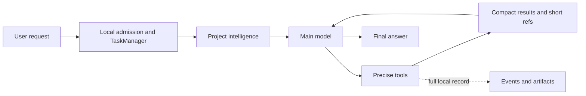

# KnightFrame

**A Windows-first local coding agent designed around cost and speed.**

KnightFrame is built with Rust, Tauri, and Svelte. Instead of relying on increasingly large prompts, it combines full-project indexing, precise tools, stable cache prefixes, and optional auxiliary models so the main model can complete real development work with less repeated context.

[简体中文](README.md) · [Development docs](docs/development/README.md) · [Contributing](CONTRIBUTING.md) · [Security](SECURITY.md)

> [!IMPORTANT]
> KnightFrame is currently in **public beta**. Core chat, project indexing, the tool loop, provider adapters, the in-app browser, and the desktop UI are usable. Plugin Studio and the plugin runtime are still being completed. Do not use the beta unattended in critical production environments.

## Why KnightFrame

Coding-agent cost is not only a model-pricing problem. Repeated directory listings, full-file reads, duplicated tool output, and unstable request prefixes all waste tokens and time.

KnightFrame addresses that at the harness level:

- **Project intelligence first** — build a persistent index of files, symbols, and references, then query exact locations instead of repeatedly running broad discovery commands.
- **Right-sized tool output** — keep complete results locally while the model receives a compact, actionable projection. Details remain available through short references.
- **Precise reads and edits** — range reads, short file versions, and fragment-level edits avoid retransmitting entire files for small changes.
- **Stable prompt prefixes** — keep system instructions, tool schemas, and history ordering deterministic to improve provider prompt-cache reuse.
- **No hidden auxiliary spend** — requirement reduction, skill routing, and memory judgement are separately controlled by the user. Deterministic local logic is the default.
- **Visible execution** — tasks, tools, cache usage, tokens, cost, and auxiliary-model work have explicit UI receipts without polluting model context.

The release target is at least 20% lower average billed cost than a mainstream coding-agent baseline under the same main model and task criteria, without reducing completion rate. **That is an acceptance threshold, not a currently verified marketing claim.**

## Implemented capabilities

| Area | Current capability |
|---|---|
| Agent core | Streaming multi-turn tool loop, mid-run guidance, cancellation, long tasks, TaskManager |
| Project understanding | Full manifest, symbol/reference graph, persistent lookup index, incremental refresh |
| Built-in tools | Precise `read`, fragment-level `edit`, `write`, indexed `search`, silent `run`, short result refs |
| Provider protocols | Common Responses, Chat Completions, Messages, and Generate Content APIs |
| Custom providers | Cloud providers, routing gateways, local inference servers, and custom endpoints |
| Multimodal input | PNG, JPEG, WebP, and GIF attachments with preview and removal before sending |
| Browser | Multi-tab browser inside the main window, address search, navigation, rendered-page agent control |
| Observability | Token, cache-hit, cost, timing, tool workflow, and auxiliary-model activity |
| Plugins | Compatible manifests and exports, cross-language JSON-RPC wire, Plugin Studio Beta |
| Desktop | Black-and-white UI, English/Chinese localization, Markdown, syntax highlighting, session management |

## How it works



Only the main model advances the task and produces the final answer. Optional auxiliary models may reduce a request, choose a skill, or judge whether memory is relevant when explicitly enabled. They cannot edit files, invoke project tools, or replace the main model.

## Models and credentials

KnightFrame does not bundle or hard-code models. Configure a provider, discover models through its live `/models` endpoint, or add one manually with explicit tool, image-input, and context capabilities. Thinking can be enabled per model at minimal, low, medium, or high effort; each adapter translates that setting to its native wire format.

API keys are stored in **Windows Credential Manager**, not ordinary configuration files. Unknown endpoints and models are not assumed compatible based only on their names; use capability probing or an explicit user override.

## Build from source

### Requirements

- Windows 10/11
- Microsoft Edge WebView2 Runtime
- Rust stable with the MSVC toolchain
- Visual Studio C++ Build Tools
- Node.js 22+
- pnpm 10+

### Build

```powershell
git clone <your-fork-or-repository-url>
cd knightframe-rs
pnpm install

pnpm tauri dev          # Full desktop development mode
pnpm build:test-exe     # Release-profile standalone test EXE, no installer
pnpm build:release      # Portable EXE, MSI, and NSIS
```

Do not ship a bare `cargo build --release` binary: it does not follow the project contract for embedded frontend assets. `pnpm build:test-exe` produces `KnightFrame-Test.exe`, which needs neither localhost nor a separate server.

## Development and verification

```powershell
pnpm check              # Svelte / TypeScript
pnpm lint               # rustfmt + clippy -D warnings
pnpm test               # Rust unit and integration tests
pnpm bench              # Index, tool projection, SSE, and core benchmarks
pnpm smoke:ui           # Headless UI smoke checks
pnpm export:opensource  # Create a clean open-source export
```

Provider, streaming, tool, cache, and plugin-protocol changes should include focused tests or sanitized protocol fixtures. All visible UI copy belongs in the shared English and Chinese localization catalog.

## Current boundaries

- Windows is the only supported release platform today.
- KnightFrame currently grants broad, unlimited local access by default. Open only projects and plugins you trust.
- Real trading, order placement, position changes, and automated purchases are always prohibited.
- Plugin Studio supports design, code, real-host preview, and export, while third-party process lifecycle, dependency recovery, and transactional hot reload remain incomplete.
- The 20% cost target still requires validation on a frozen task set, the same model, and actual provider billing.
- Telemetry is off by default. Project content is sent only to endpoints configured by the user.

## Documentation

- [Product contract and cost threshold](docs/development/00-product-contract.md)
- [System and runtime architecture](docs/development/01-system-architecture.md)
- [Main and auxiliary model boundaries](docs/development/02-model-roles.md)
- [Project intelligence and code graph](docs/development/03-project-intelligence.md)
- [Tools, context, and caching](docs/development/04-tools-context-cache.md)
- [Providers, security, and data](docs/development/07-providers-security.md)
- [Delivery, evaluation, and cost gates](docs/development/08-delivery-verification.md)
- [Harness parity roadmap](docs/development/11-harness-parity-roadmap.md)
- [Plugin protocol and Plugin Studio](docs/development/12-plugins-studio.md)

## Contributing

Issues, protocol fixtures, provider adapters, Windows compatibility fixes, performance benchmarks, and UI improvements are welcome. Read [CONTRIBUTING.md](CONTRIBUTING.md) before opening a pull request. Report vulnerabilities privately according to [SECURITY.md](SECURITY.md); never attach credentials, private project content, or unsanitized diagnostics to a public issue.

## License

KnightFrame is licensed under the [Apache License 2.0](LICENSE). See [NOTICE](NOTICE) and [REFERENCES.md](docs/development/REFERENCES.md) for third-party notices and reference boundaries.
