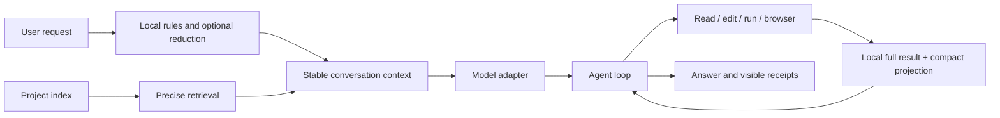

# KnightFrame

> Beta · Local coding agent for Windows

[中文](README.md)

KnightFrame is built with Rust, Tauri, and Svelte. It reduces repeated context through project indexing, precise tools, and stable request prefixes while keeping model selection, tool activity, and usage visible.

## Execution model



The main model advances the task. Auxiliary models, skills, and memory are optional; local rules are used when they are disabled.

## Project index

Opening a project creates a complete lookup index containing:

- files and detected languages;
- symbol definitions and source lines;
- incoming and outgoing references;
- directories, modules, and highly connected nodes;
- incremental refreshes after edits.

Retrieval resolves paths, symbols, and references through the index before reading exact lines. Full tool results remain local; the model receives only the projection required for the task.

## Status

KnightFrame is beta software. Conversation, project indexing, tools, model adapters, the embedded browser, and Plugin Studio are available. Provider compatibility continues to be refined as upstream protocols change.

## Plugin Studio host preview

The KnightFrame preview uses the UI embedded in the build and does not require another KnightFrame source checkout. Plugin design and adapter export also work without DSH.

The real DSH host preview requires a locally built DSH repository. With Node.js 22.19+ and pnpm 11.7+, run from the DSH repository root:

```powershell
pnpm install --frozen-lockfile
pnpm build
[Environment]::SetEnvironmentVariable("KF_DSH_ROOT", "D:\Projects\deepseek-harness-master", "User")
```

`KF_DSH_ROOT` must point to the repository root containing `apps/cli/lib/bin.js`. Restart KnightFrame after setting it. Alternatively, name the repository `deepseek-harness-master` and place it beside `KnightFrame.exe` or in its parent directory.

## Build

Requires Rust stable, Node.js 20+, pnpm 9+, Windows WebView2, and Visual Studio C++ Build Tools.

```powershell
pnpm install
pnpm check
pnpm test
pnpm build:test-exe
```

Release build:

```powershell
pnpm build:release
```

OpenAI Codex is used for development and review.
