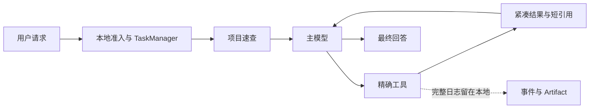

# KnightFrame

**一个以省钱和速度为第一优先级的 Windows 本地编程 Agent。**

KnightFrame 使用 Rust、Tauri 与 Svelte 构建。它不依靠堆叠超长 Prompt 提升模型表现，而是通过全量项目速查、精确工具、稳定缓存前缀和可选副模型，让主模型用更少的上下文完成真实开发任务。

[English](README.en.md) · [开发文档](docs/development/README.md) · [参与贡献](CONTRIBUTING.md) · [安全策略](SECURITY.md)

> [!IMPORTANT]
> KnightFrame 目前处于 **公开 Beta**。核心对话、项目索引、工具循环、模型适配、内置浏览器和桌面 UI 已可使用；Plugin Studio 与插件运行时仍在持续完善。请勿将 Beta 版本用于无人监督的关键生产环境。

## 为什么做 KnightFrame

多数编程 Agent 的浪费不只来自模型价格，还来自反复列目录、整文件读取、重复发送工具结果，以及不断变化的系统前缀。

KnightFrame 尝试从 harness 本身解决这些问题：

- **项目速查优先**：打开项目后建立全量文件、符号和引用索引；模型按名称查询精确位置，而不是反复执行 `ls` 和大范围搜索。
- **工具输出恰好够用**：完整结果保留在本地，主模型只收到可继续工作的紧凑投影；需要细节时再通过短引用取回。
- **精确读写**：范围读取、短版本定位和字符片段编辑，避免只改一行却重传整份文件。
- **稳定缓存前缀**：系统指令、工具 Schema 和历史按稳定顺序组织，尽量提高供应商 Prompt Cache 命中率。
- **可选智能不暗中消费**：需求压缩、Skill 路由和记忆判断的副模型均由用户独立启用；默认优先使用本地确定性逻辑。
- **所有能力都有回执**：任务、工具、缓存、Token、费用和副模型工作在 UI 中独立呈现，不混入模型上下文。

项目目标是在相同主模型和相同任务标准下，比主流编程 Agent 基线降低至少 20% 的平均实际费用，同时不降低完成率。**这是发布门槛，不是当前已经验证的宣传数字。**

## 已实现能力

| 领域 | 当前能力 |
|---|---|
| Agent 核心 | 流式多轮工具循环、运行中追加指令、随时停止、长任务、TaskManager |
| 项目理解 | 全量项目清单、符号与引用图谱、持久化速查、增量刷新、短查询结果 |
| 内置工具 | 精确 `read`、字符级 `edit`、`write`、索引 `search`、静默 `run`、结果短引用 |
| 模型适配 | Responses、Chat Completions、Messages、Generate Content 等常见 API 协议 |
| 自定义供应商 | 云端供应商、聚合网关、本地推理服务及自建兼容端点 |
| 多模态 | PNG、JPEG、WebP、GIF 拖放或选择，发送前预览与移除 |
| 浏览器 | 主窗口内多标签浏览、地址搜索、历史导航，以及 Agent 渲染态读取与交互 |
| 可观测性 | Token、缓存命中、费用、耗时、工具工作流和副模型活动 |
| 插件 | 兼容清单与导出、跨语言 JSON-RPC Wire、Plugin Studio Beta |
| 桌面体验 | 黑白主题、中英双语、Markdown 与语法高亮、会话管理、Windows 凭据存储 |

## 工作方式



主模型始终负责推进任务和作出最终回答。副模型只能承担用户明确开启的需求压缩、Skill 选择或记忆判断，不能编辑文件、调用项目工具或替代主模型回答。

## 模型与密钥

KnightFrame 不内置、捆绑或写死任何模型。用户创建供应商配置后，可通过实时 `/models` 发现模型，也可以手动添加模型并声明工具、多模态和上下文能力。每个模型可独立开启思考并选择最小、低、中、高力度，适配器会转换为对应协议的原生参数。

API 密钥存入 **Windows Credential Manager**，不会写入普通配置文件。未知端点或模型不会仅凭名称被假定为完整兼容；能力应通过探测或用户明确覆盖。

## 从源码运行

### 环境

- Windows 10/11
- Microsoft Edge WebView2 Runtime
- Rust stable（MSVC toolchain）
- Visual Studio C++ Build Tools
- Node.js 22+
- pnpm 10+

### 构建

```powershell
git clone <your-fork-or-repository-url>
cd knightframe-rs
pnpm install

pnpm tauri dev          # 完整桌面开发模式
pnpm build:test-exe     # Release 配置的独立测试 EXE，不生成安装器
pnpm build:release      # 便携 EXE、MSI 与 NSIS
```

不要用裸 `cargo build --release` 交付桌面版本；它不会按项目合同嵌入完整前端资源。`pnpm build:test-exe` 生成的 `KnightFrame-Test.exe` 无需 localhost 或单独启动服务端。

## 开发与验证

```powershell
pnpm check              # Svelte / TypeScript
pnpm lint               # rustfmt + clippy -D warnings
pnpm test               # Rust 单元与集成测试
pnpm bench              # 索引、工具投影、SSE 与核心基准
pnpm smoke:ui           # 无窗口 UI 冒烟检查
pnpm export:opensource  # 生成独立开源目录
```

更改 Provider、流式解析、工具、缓存或插件协议时，请同时增加协议 fixture 或针对性测试。所有 UI 文案必须进入统一中英文资源，不能直接写进组件。

## 当前边界

- Windows 是当前唯一正式目标平台。
- KnightFrame 默认提供不限时的广泛本地访问；用户应只打开自己信任的项目与插件。
- 真实交易、下单、持仓变更和自动购买始终禁止。
- Plugin Studio 已提供设计、代码、真实宿主预览和导出，但第三方插件进程生命周期、依赖恢复与事务式热重载尚未全部完成。
- “比主流基线省 20%”仍需在冻结任务集、相同模型和真实供应商账单上验证。
- 默认零遥测；项目内容只会发送到用户主动配置的模型端点。

## 文档

- [产品合同与成本门槛](docs/development/00-product-contract.md)
- [系统与运行时架构](docs/development/01-system-architecture.md)
- [主模型与副模型边界](docs/development/02-model-roles.md)
- [项目速查与代码图谱](docs/development/03-project-intelligence.md)
- [工具、上下文与缓存](docs/development/04-tools-context-cache.md)
- [供应商、安全与数据](docs/development/07-providers-security.md)
- [交付、评测与成本门禁](docs/development/08-delivery-verification.md)
- [Harness 对齐路线图](docs/development/11-harness-parity-roadmap.md)
- [插件协议与 Plugin Studio](docs/development/12-plugins-studio.md)

## 参与贡献

欢迎提交 Issue、协议 fixture、Provider 适配、Windows 兼容修复、性能基准和 UI 改进。开始前请阅读 [CONTRIBUTING.md](CONTRIBUTING.md)。安全问题请按 [SECURITY.md](SECURITY.md) 私下报告，不要在公开 Issue 中提交密钥、项目内容或诊断日志。

## 许可证

KnightFrame 使用 [Apache License 2.0](LICENSE) 开源。第三方组件与引用边界见 [NOTICE](NOTICE) 和 [REFERENCES.md](docs/development/REFERENCES.md)。
