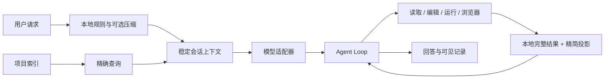

# KnightFrame

> Beta · Windows 本地编程 Agent

[English](README.en.md)

KnightFrame 使用 Rust、Tauri 和 Svelte 构建。它以项目索引、精确工具和稳定请求前缀降低重复上下文，同时保留模型选择、工具过程与用量信息。

## 工作原理



主模型负责推进任务。小模型、Skill 和记忆均为可选项；未启用时使用本地规则。

## 项目索引

项目打开后，KnightFrame 建立全量速查索引：

- 文件与语言清单
- 符号定义及所在行
- 引用与被引用关系
- 目录、模块和高关联节点
- 编辑后的增量刷新

查询优先从索引定位路径、符号和引用，再按需读取具体行。完整工具结果保存在本地，模型只接收完成任务所需的投影。

## 状态

当前为 Beta。核心对话、项目索引、工具、模型适配、内置浏览器和插件工坊可用；协议兼容性仍会随供应商行为继续校正。

## 插件工坊宿主预览

KnightFrame 预览使用构建产物内嵌的界面，不需要额外放置 KnightFrame 源码。插件设计和适配器导出也不依赖 DSH。

真实 DSH 宿主预览需要本机存在已构建的 DSH 仓库。准备 Node.js 22.19+ 和 pnpm 11.7+，在 DSH 根目录执行：

```powershell
pnpm install --frozen-lockfile
pnpm build
[Environment]::SetEnvironmentVariable("KF_DSH_ROOT", "D:\Projects\deepseek-harness-master", "User")
```

`KF_DSH_ROOT` 应指向包含 `apps/cli/lib/bin.js` 的仓库根目录。重启 KnightFrame 后生效。也可将该仓库命名为 `deepseek-harness-master`，放在 `KnightFrame.exe` 同级目录或其上一级目录。

## 构建

需要 Rust stable、Node.js 20+、pnpm 9+、Windows WebView2 和 Visual Studio C++ Build Tools。

```powershell
pnpm install
pnpm check
pnpm test
pnpm build:test-exe
```

发布构建：

```powershell
pnpm build:release
```

项目使用 OpenAI Codex 协助开发与检查。
