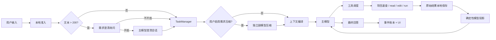

# 01 — 系统与运行时架构

## 1. 架构目标

系统必须同时满足：

- 主任务热路径短、可预测；
- 项目索引、工具、provider、UI 可独立测试；
- Windows 进程、路径和权限不是后补适配；
- 所有状态通过类型化事件流动，不从日志文本反推；
- 每个模型调用、工具调用、文件变更和缓存命中可结算；
- 功能可以关闭后从热路径和 prompt 中完全消失；
- 不复制旧 Kotlin 的巨型类、全局状态和隐式耦合。

## 2. 技术基线

| 层 | 选择 | 说明 |
|---|---|---|
| 核心语言 | Rust stable | 单一核心实现，异步运行时使用 Tokio |
| 桌面壳 | Tauri 2 | Windows 首发；核心逻辑不得写进 command handler |
| 前端 | Svelte 5 + TypeScript | 事件驱动、严格类型、统一 i18n |
| 本地数据库 | SQLite | 任务、图谱、用量、事件和配置分库或分 schema 管理 |
| 代码解析 | tree-sitter + 语言适配层 + 可选 LSP 增强 | tree-sitter 提供离线基线，LSP 只增强精度 |
| 文本检索 | SQLite FTS5 + 精确/前缀/模糊排序 | 默认不依赖 embedding |
| 网络 | reqwest + provider 专用流解析 | 不用一个“兼容 API”吞掉供应商差异 |
| 序列化 | serde | 所有跨层结构版本化 |
| 安装 | Windows 签名安装包 | 发布验收基于安装包，不基于开发命令 |

## 3. 工作区边界

建议保持少量、责任清晰的 crate，避免把每个类型拆成一个包：

```text
knightframe-rs/
  apps/
    desktop/              # Tauri 命令、窗口、托盘、更新
    ui/                   # Svelte UI，仅消费命令与事件
  crates/
    kf-core/              # 会话、Turn、TaskManager、事件、上下文编译
    kf-provider/          # 主/副 ExecutionTarget 与供应商适配
    kf-project/           # 全量项目速查、解析、查询、增量更新
    kf-tools/             # project/read/edit/run/MCP 调度与投影
    kf-feature/           # Skill、SkillOpt、九层记忆、功能注册表
    kf-policy/            # Windows 路径、权限、审批、进程策略
    kf-bench/             # 固定任务集、账单采集、质量与成本对比
  resources/
    locales/
      en-US.json
      zh-CN.json
    provider-catalog/     # 只含已验证能力基线，不冒充实时模型目录
  docs/
```

### 3.1 依赖方向

```text
apps/ui -> apps/desktop -> kf-core
kf-core -> kf-provider, kf-project, kf-tools, kf-feature, kf-policy
kf-tools -> kf-project, kf-policy
kf-feature -> kf-project
kf-bench -> 上述公开接口
```

约束：

- `kf-provider` 不依赖 UI、项目索引或工具实现；
- `kf-project` 不依赖模型；首次构建和增量更新必须零 LLM；
- `kf-tools` 不直接操作前端；只发类型化事件；
- `kf-feature` 的可选能力不能改变核心协议；
- UI 不直接读 SQLite，也不解析后端日志；
- crate 之间不得形成循环依赖。

## 4. 核心运行对象

### 4.1 标识符

内部使用强类型 ID，跨模型边界只显示短 ID：

```rust
SessionId
TurnId
TaskId
CallId
ToolCallId
ArtifactId
ProjectSnapshotId
FileVersion
FeatureRunId
```

模型可见形式示例：`T4`、`C7`、`A3`、`F18/v6`。数据库主键与内部完整指纹不得直接发送给模型。

### 4.2 Turn 生命周期

```text
Accepted
  -> ClarificationOffered? 
  -> Clarifying? 
  -> Admitted
  -> ContextCompiled
  -> MainModelRunning
  -> ToolRunning <-> MainModelRunning
  -> Settling
  -> Completed | Failed | Cancelled
```

规则：

- `ClarificationOffered` 只由本地长度规则产生；
- TaskManager 在 `Accepted` 后立即建立本地任务记录；
- 项目未 `Ready` 时，代码任务停在 `Admitted` 并显示索引进度；
- 副模型任务是独立 `AuxRun`，不能改变 Turn 状态；
- 每个终止状态必须有稳定原因码；
- 取消必须向 provider 流、工具进程和子进程树传播。

### 4.3 Task 与 Turn 的区别

- `Turn` 是一次用户消息引发的运行。
- `Task` 是可能跨多个 Turn 的目标，由 TaskManager 管理。
- 一个 Task 可包含澄清 Turn、执行 Turn、用户修正 Turn。
- 同一会话内一次只允许一个主 Turn 执行；项目索引和低优先级后台工作可并行。

## 5. 端到端数据流



关键点：

- 副模型只在用户为“需求压缩”单独开启时进入图中；
- Skill 与记忆默认通过本地匹配在上下文编译前完成；
- 原始工具结果不先发给主模型再删减；
- UI 既显示正常回答，也独立显示工具卡片、时间、token、缓存与费用；
- 所有指标旁路记录，不回灌 prompt。

## 6. 运行时调度

### 6.1 调度器拆分

不建立一个包揽所有职责的巨型 `TaskRuntime`。运行时由小状态机协作：

| 组件 | 职责 |
|---|---|
| `Admission` | 建立 Turn、长度检测、项目就绪与权限前检 |
| `SessionLane` | 保证同会话主 Turn 串行 |
| `GlobalScheduler` | 跨会话公平调度 |
| `RoleQuota` | 为主模型、工具、可选副模型分配槽位 |
| `ProviderLimiter` | 每个物理 provider 的并发与速率限制 |
| `CancellationTree` | 会话、Turn、调用、进程的级联取消 |
| `EventLedger` | 持久化状态变化、回执和可重放 UI 事件 |
| `UsageLedger` | token、缓存、费用和来源口径 |

### 6.2 优先级

从高到低：

1. 用户主动取消、审批与交互；
2. 当前主模型调用；
3. 当前主任务所需工具；
4. 项目索引增量更新；
5. 用户显式启用的副模型任务；
6. SkillOpt 离线优化、清理和其他后台任务。

副模型和后台工作不得占满主任务需要的最后一个槽位。用户输入到达时，可暂停尚未开始的低优先级任务；运行中的文件事务不得半途留下不一致状态。

### 6.3 背压

- UI 流事件按时间和字符阈值合并，不能每个 token 都跨 Tauri IPC；
- provider 流与工具 stdout 使用有界通道；
- 队列满时先拒绝新的后台任务，不驱逐运行中的主任务；
- 事件账本写入失败时，主任务进入明确降级状态，不能假装拥有可恢复历史；
- 工具大输出直接落 artifact 存储，通过摘要事件通知 UI。

## 7. 类型化事件协议

事件是 UI、诊断、恢复和验收的共同事实来源。核心事件示例：

```text
TurnAccepted
ClarificationOffered
ClarificationAnswered
TaskCreated
TaskUpdated
ProjectIndexStarted
ProjectIndexProgress
ProjectIndexReady
ProjectIndexStale
AuxRunStarted
AuxRunSkipped
AuxRunFinished
MainCallStarted
MainStreamDelta
ReasoningSummaryDelta
ToolCallStarted
ToolCallFinished
ArtifactStored
FileChanged
UsageUpdated
CacheReceipt
FeatureReceipt
TurnCompleted
TurnFailed
TurnCancelled
```

每个事件包含：

- `schema_version`；
- `event_id`、时间和所属 `session/turn/task`；
- 稳定状态码或资源键；
- 结构化参数；
- 可选本地 artifact 引用；
- 不包含已经本地化的 UI 句子。

高频流式 delta 可不逐条持久化；必须定期形成可恢复 checkpoint。工具开始、工具结束、文件变更、费用、功能回执和终止状态必须持久化。

## 8. 数据存储

### 8.1 分区

| 存储 | 内容 | 默认保留 |
|---|---|---|
| 配置库 | provider profile、功能开关、locale、权限 | 直到用户删除 |
| 会话库 | Task、Turn、消息、事件 checkpoint | 用户设置 |
| 项目库 | 文件、符号、关系、搜索索引、快照状态 | 项目级 |
| artifact 库 | 工具原始结果、完整 diff、运行输出 | 有界容量/LRU |
| 用量库 | provider usage、缓存、费用来源 | 用户设置 |
| 记忆库 | 九层记忆 | 默认不创建；启用后独立管理 |

### 8.2 原子性

- 单文件 edit：临时文件写入、刷新、替换，成功后才发布 `FileChanged`；
- 多文件 edit：先全部验证，再提交；任一验证失败则不写入；
- 图谱增量：构建新 generation，查询只读上一个完整 generation，提交后一次切换；
- 任务状态与终止事件在同一事务结算；
- 安装升级对 schema 使用可回滚迁移。

## 9. 功能注册表

所有正式功能登记在版本化 manifest 中：

```toml
id = "project.graph"
owner = "kf-project"
default = "on"
trigger = "workspace_open"
receipt = "project.index.ready"
metrics = ["ready_ms", "coverage", "stale_queries"]
acceptance = ["win_clean_install", "graph_fixture"]
status = "designed"
```

CI 必须验证：

- owner 模块存在；
- receipt 事件有生产者；
- metrics 有记录点；
- acceptance 测试存在；
- UI 使用的全部资源键在中英文 catalog 存在；
- `verified` 功能没有任一空项；
- UI 正式设置页只展示 `shipped`，实验页可展示 `verified`。

## 10. 失败与恢复

### 10.1 应用崩溃

重启后：

- 恢复最后完整 Task/Turn checkpoint；
- 未结束 provider 调用标记为 `interrupted`，不猜结果；
- 未结算工具调用检查进程与文件提交状态；
- 图谱半成品 generation 丢弃或继续，不标 Ready；
- artifact 写入只承认完整提交项。

### 10.2 项目外部变化

检测到编辑器、Git checkout、构建生成器或其他进程修改文件时：

- 立即将相关项目区域标 `Updating`；
- 旧 generation 仍可用于不相关区域；
- 涉及已变文件的查询明确返回 `stale`，等待更新或走精确磁盘读取；
- 不把旧符号位置用于 edit。

### 10.3 Provider 故障

- 保留供应商原始错误码和请求 ID 到本地诊断；
- UI 显示资源键和必要参数；
- 不自动切模型或供应商，除非用户配置了清晰可见的 fallback；
- fallback 会产生独立回执、费用和缓存断裂原因。

## 11. 本文档验收

- 架构依赖图可由 Cargo workspace 自动检查，无循环；
- Turn 状态机覆盖成功、失败、取消、崩溃恢复；
- 10,000 个高频 delta 不造成 UI 卡顿或逐条数据库写入；
- 同会话严格串行，不同会话并行；
- 副模型占满其配额时，主模型仍可立即获得保留槽；
- 项目 generation 切换无混合快照；
- 所有 UI 状态可由事件重放恢复，不解析文本日志。
